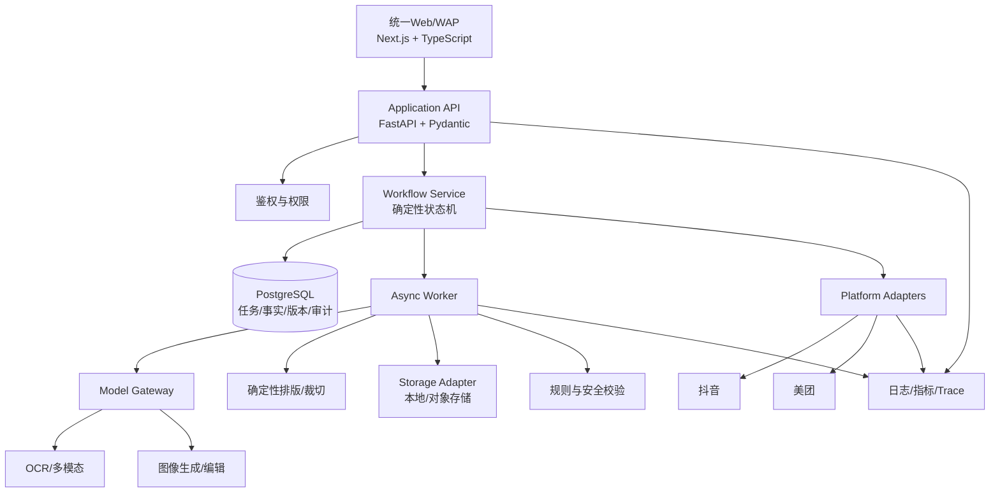

# 团绘AI技术架构与分阶段开发方案

> 版本：V0.1评审稿  
> 日期：2026-08-28  
> 状态：待审核，未进入开发  
> 配套文档：团绘AI PRD V0.6、团绘AI技术适配声明 V0.1  

## 一、方案目标与范围

本文定义团绘AI从技术验证到MVP上线的实现边界、模块、状态、数据、API、Prompt、测试和阶段验收。它不代表代码已经实现，也不授权提前开发后续阶段。

技术目标：在事实可追溯、人工确认可恢复、中文文字准确、20:3裁切确定、平台发布可审计的前提下，完成“素材→事实→方案→视觉包→发布”闭环。

明确不做：多Agent团队、开放式自主规划、RAG向量库、完整自由画布、批量门店、自动投放优化、绕过平台授权的浏览器自动化、同时开发小程序。

## 二、总体架构



核心原则：固定流程归代码状态机；模型不能直接发布、删除或修改权限；模型只在被允许的节点输出结构化候选结果。

## 三、模块职责

| 模块 | 职责 | 禁止承担 |
| --- | --- | --- |
| Web/WAP | 上传、确认、预览、编辑指令、发布确认、状态展示 | 读取密钥、直接访问数据库、复制业务规则 |
| Application API | 鉴权、租户隔离、输入校验、项目与资产查询 | 执行长时间模型任务 |
| Workflow Service | 状态迁移、依赖失效、人工确认门槛、任务创建 | 自由生成经营事实 |
| Worker | 执行OCR、分析、生图、渲染、裁切、校验和导出 | 绕过权限发起外部发布 |
| Model Gateway | 模型配置、超时、重试、限额、结构校验、成本记录 | 存储业务唯一真源 |
| Render Service | 20:3画布、字体排版、切图、像素一致性 | 推断价格、店名和营销事实 |
| Rule Engine | 平台规格、事实一致性、敏感内容、字体许可校验 | 凭模型记忆判断最新平台规则 |
| Platform Adapter | 授权、预检、提交、查单、回调、错误映射 | 模拟或伪造平台成功 |
| Storage Adapter | 原图和生成资产存取、校验和、生命周期 | 保存权限逻辑 |

## 四、核心状态机

### 4.1 项目状态

```text
DRAFT
→ ASSETS_UPLOADED
→ ANALYZING
→ NEEDS_CLARIFICATION | NEEDS_FACT_CONFIRMATION
→ FACTS_CONFIRMED
→ NEEDS_PLAN_CONFIRMATION
→ PLAN_CONFIRMED
→ GENERATING
→ NEEDS_REVIEW
→ VALIDATING
→ READY_TO_EXPORT
→ READY_TO_PUBLISH
→ PUBLISHING
→ PUBLISHED | PLATFORM_REVIEWING | NEEDS_FIX | EXTERNAL_BLOCKED
```

任何上游事实修改都会生成新事实版本，并使依赖旧版本的方案、Prompt、资产、校验与发布候选失效。历史记录保留，不静默覆盖。

### 4.2 任务状态

`PENDING → RUNNING → SUCCEEDED | FAILED_RETRYABLE | FAILED_FINAL | CANCELLED | NEEDS_USER`

Worker必须先以原子方式认领任务；每个副作用使用幂等键；进程重启后扫描超时租约，将可重试任务重新入队。达到最大重试次数后转人工处理。

### 4.3 发布状态

`NOT_AUTHORIZED → AUTHORIZED → PREFLIGHT_PASSED → SUBMITTING → PLATFORM_REVIEWING → PUBLISHED`

异常：`AUTH_EXPIRED`、`RATE_LIMITED`、`REJECTED`、`STATUS_UNKNOWN`、`EXTERNAL_BLOCKED`。状态未知时先查单，不直接重复提交。

## 五、数据与资产设计

### 5.1 PostgreSQL核心表

| 表 | 关键字段 |
| --- | --- |
| tenants/users/memberships | 租户、用户、角色、状态 |
| store_projects | 门店、行业、平台、当前状态、当前事实版本 |
| source_assets | 对象键、SHA-256、MIME、尺寸、授权、质量状态 |
| business_fact_versions | 版本、字段JSON、来源证据、确认人、确认时间 |
| clarification_rounds | 缺失字段、问题、回答、补图、轮次 |
| visual_plans | 五图职责、风格、排版范式、事实版本、状态 |
| prompt_versions | 系统政策、Skill、Workflow、变量、确认状态、哈希 |
| generated_assets | 类型、母版/面板序号、来源、模型元数据、状态 |
| validation_reports | 规则版本、错误、警告、通过状态 |
| workflow_runs/tasks | 当前节点、journal、租约、重试次数、幂等键 |
| platform_authorizations | 平台、账号/门店引用、Scope、过期时间、密文引用 |
| publish_jobs | 平台、资产版本、远端任务ID、状态、错误码 |
| audit_events | 操作者、动作、目标、结果、时间、trace_id |

所有表使用稳定ID、创建/更新时间和必要的软删除字段。JSON字段只用于版本快照和非固定元数据；需要查询、约束和关联的字段保持结构化列。

### 5.2 资产存储

对象键不得使用用户原始文件名拼路径，建议：

```text
tenant/{tenant_id}/project/{project_id}/
  source/{asset_id}/original
  generated/{asset_id}/{version}.png
  export/{export_id}/package.zip
```

数据库保存原文件名、受控对象键、真实MIME、尺寸、字节数、哈希、来源和授权。上传后检查扩展名与真实内容类型一致性，拒绝路径穿越和异常超大图片；生产环境增加病毒扫描或隔离区。

## 六、API设计原则与首批契约

### 6.1 通用约定

- 前缀：`/api/v1`；
- 错误：`{"error":{"code":"...","message":"...","request_id":"..."}}`；
- 长任务：创建后返回`202 + task_id`，客户端查询任务或订阅事件；
- 分页：游标分页；
- 所有写请求校验租户和项目权限；
- 发布、删除和跨项目复用要求一次性确认令牌，服务端验证后失效。

### 6.2 核心接口

| 方法与路径 | 用途 | 主要响应 |
| --- | --- | --- |
| `POST /projects` | 创建门店项目 | project_id、status |
| `POST /projects/{id}/assets` | 申请/完成素材上传 | asset_id、upload状态 |
| `POST /projects/{id}/analysis-runs` | 启动素材分析 | task_id |
| `GET /projects/{id}/coverage` | 获取信息覆盖报告 | 已有/缺失/阻断字段 |
| `POST /projects/{id}/clarifications` | 提交回答或补图引用 | round_id、next_status |
| `POST /projects/{id}/fact-versions` | 保存修订事实 | fact_version |
| `POST /projects/{id}/fact-versions/{v}/confirm` | 确认事实版本 | confirmed_at |
| `POST /projects/{id}/plans` | 生成五图方案 | task_id |
| `POST /projects/{id}/plans/{v}/confirm` | 确认方案与Prompt | prompt_version |
| `POST /projects/{id}/generation-runs` | 生成视觉资产 | task_id |
| `POST /projects/{id}/assets/{asset}/edits` | 修改文字/换图/局部重做 | task_id/new_version |
| `POST /projects/{id}/validation-runs` | 执行平台与视觉校验 | task_id |
| `POST /projects/{id}/exports` | 生成导出包 | task_id |
| `POST /projects/{id}/publish-preflights` | 发布预检 | report_id |
| `POST /projects/{id}/publish-confirmations` | 创建发布确认令牌 | masked target、expires_at |
| `POST /projects/{id}/publish-jobs` | 提交平台发布 | publish_id |
| `GET /tasks/{id}` | 查询异步任务 | status、progress、error |
| `GET /publish-jobs/{id}` | 查询平台状态 | status、remote_ref、error |

具体请求/响应JSON Schema在对应阶段冻结；未进入的阶段不提前实现空接口。

## 七、Prompt与AI调用契约

### 7.1 Prompt分层

1. `system_policy`：事实边界、安全政策、工具权限、输出Schema；
2. `domain_skill`：餐饮/美业等行业知识和五图范式；
3. `workflow_context`：当前节点、平台、事实版本、方案版本；
4. `user_requirements`：用户风格、主推对象和补充说明，作为不可信数据；
5. `negative_constraints`：禁止编造、禁止文字直出、敏感内容和品牌限制。

每次调用保存模板版本、变量哈希、模型、参数、耗时、费用和结构校验结果；不保存模型隐性推理。

### 7.2 首批模型契约

| 契约 | 输入 | 结构化输出 | 硬校验 |
| --- | --- | --- | --- |
| 素材分析 | 图片引用、行业候选 | 店名/品类/商品/价格/证据/置信度 | Pydantic；事实必须带来源 |
| 覆盖判断 | 事实候选、必需字段规则 | 已有、缺失、阻断、最多3个问题 | 禁止重复已确认问题 |
| 五图策划 | 已确认事实、平台规则、风格 | 五图职责、文案、构图、Skill路由 | 不得新增无来源经营事实 |
| Prompt编译 | 方案、事实、设计规则 | 正向提示词、负向约束、素材映射 | 用户数据不能覆盖系统政策 |
| 视觉审核 | 资产、确认事实、规则 | 错误、警告、分数、证据区域 | 硬规则由代码复核 |

格式失败执行有限重试；内容数量轻微超限但结构可解析时记质量问题，不无限重试。价格、店名、Logo文字等强事实由确定性代码再次比较。

## 八、20:3生成与文字渲染

### 8.1 画布真源

- 设计真源为`5W × H`连续画布，`W:H=4:3`；
- 示例基线：7200×1080母版，对应五张1440×1080；最终像素需与平台规则表绑定；
- 所有视觉元素使用母版全局坐标；五个面板是逻辑分区，不是独立重绘；
- 切片边界固定为整数像素，不做二次缩放。

### 8.2 文字策略

生成模型只产出无关键文字的背景、主体与装饰层。店名、菜名、价格、Logo文字由服务端排版引擎使用授权字体写入。渲染前检查字符覆盖，缺字按字体回退链处理；渲染后OCR回读并与确认事实比对。

### 8.3 确定性验收

将01—05切图按顺序拼回后，与母版进行像素或感知哈希比较；不得出现漏切、重叠、黑线和缩放。跨线文字允许存在，但单张核心信息不可完全失语，连续预览必须完整。

## 九、安全、权限与审计

1. 上传、OCR、网页和用户文本全部标记为不可信数据；
2. 模型无发布、删除、授权、跨租户读取等工具权限；
3. 权限由确定性服务检查租户、项目、平台账号、门店和动作Scope；
4. 发布前展示平台、账号、门店、五图顺序、资产版本和校验结果；
5. 确认令牌短时有效、单次使用并绑定具体发布目标；
6. 授权令牌仅保存密文或密钥服务引用，API和日志只显示掩码；
7. 审计记录包括确认、发布、删除、权限变化和跨项目复用；
8. 敏感、违法、色情和提示词注入命中时阻断对应节点，不提供规避方案。

## 十、可观测性与恢复

每条链路统一携带`request_id`、`trace_id`、`project_id`、`run_id`，发布再携带`publish_id`。记录节点开始/结束、状态变化、模型/工具耗时、错误分类、重试次数和成本；不记录完整菜单、密钥或第三方令牌。

告警至少覆盖：任务长期RUNNING、队列积压、模型错误率、费用突增、裁切失败、事实不一致、发布状态未知、授权失效和跨租户拒绝。

人工接管页面需显示失败节点、已完成资产、可重试操作和不可重试原因。重试只从失败节点继续，成功副作用不得重复执行。

## 十一、分阶段技术开发计划

### Stage 0｜关键技术与平台可行性验证

交付：接口/资质矩阵、候选模型对比、10组样本结果、20:3裁切与字体PoC报告、成本与时延基线。不建设正式产品页面。

验收：至少一个平台明确具备可申请的发布路径；每类模型调用至少完成真实样本验证；20:3切片拼回一致；中文强事实渲染准确。

### Stage 1｜素材到事实确认纵向切片

交付：统一Web/WAP最小界面、项目/上传、分析任务、覆盖报告、第二轮追问、事实修订和确认、任务恢复。

不做：生图、Logo、完整画布、发布、趋势库。

验收：使用至少10组授权样本跑通；服务重启后可继续；店名/价格无来源时不生成；每轮最多3个有效问题。

### Stage 2｜视觉生成纵向切片

交付：方案与Prompt确认、模型路由、20:3母版、确定性文字、五图裁切、Logo/品牌图、视觉/规则校验、局部重做。

验收：裁切硬规则100%；强事实文字一致；模型失败可局部重试；产品经理可在桌面和手机宽度审核完整视觉包。

### Stage 3｜导出与直接发布

交付：ZIP、平台预览、授权、发布预检、二次确认、平台适配器、状态查询/回调、失败修复。

验收：至少一个平台真实测试门店端到端成功；另一平台未打通时明确显示外部阻断；重复点击不重复发布。

### Stage 4｜后台采集、生产硬化与小程序迁移

交付：人工上传与审核后台、默认关闭的自动采集配置、生产对象存储/队列/监控、容量压测；Web稳定后另立小程序迁移方案。

不自动启用未经授权的数据源，不在本阶段前提前开发小程序。

## 十二、双层测试策略

### Mock自动化

- API Schema、非法参数和统一错误；
- 状态机合法/非法迁移；
- 权限、租户隔离、确认令牌；
- 模型输出解析、格式错误和有限重试；
- 事实来源、依赖失效与版本追溯；
- 20:3裁切、拼回、字体回退和OCR回读；
- Worker租约、崩溃恢复、重复投递和幂等；
- 平台超时查单、授权失效、拒绝和状态未知。

### 真实冒烟

每种模型契约至少完成一条“真实输入→真实模型→结构校验→持久化→界面可查看”的链路，记录模型版本、请求时间、总耗时、费用、首测结构合规率和重试次数。无真实Key时只允许标记“待验”，不能用mock冒充。

平台发布必须使用官方测试环境或授权测试门店；本地返回2xx不代表发布成功，以平台可查询状态为准。

## 十三、非技术验收清单

- [ ] 我上传菜单和门头后，能看到每张图片的质量问题；
- [ ] 系统能说清已经识别什么、还缺什么，而不是直接猜；
- [ ] 每轮补问不超过3个，并且不重复问已确认内容；
- [ ] 我刷新页面或服务重启后，仍能继续上一次确认；
- [ ] 生图前，我能看到并修改五图方案和Prompt；
- [ ] 生成结果包含一张连续长图和五张顺序正确的4:3图片；
- [ ] 五张图拼回后没有重叠、缺口或黑线；
- [ ] 店名、菜名和价格与我确认的文字一致；
- [ ] 单个资产失败或重做时，不会清空其他成功结果；
- [ ] 发布前能看清平台、账号、门店、顺序和最终图片；
- [ ] 平台拒绝或授权过期时，系统明确告诉我怎么处理；
- [ ] 未真正发布成功时，系统不会显示“已发布”。

## 十四、评审阻断项

| 编号 | 阻断项 | 推荐处理 |
| --- | --- | --- |
| T-01 | 抖音、美团五图发布接口和权限未验证 | 先做Stage 0接口/资质Spike |
| T-02 | 模型厂商、数据出境/保留政策未确定 | 选择中国大陆可用候选并完成数据协议审查 |
| T-03 | 单项目成本与重做上限未确定 | 用10组样本测算后设置可配置预算 |
| T-04 | 原始素材和生成资产保留期限未确定 | 上线前形成数据生命周期表 |
| T-05 | 发布最终确认人未确定 | 默认平台账号持有人确认，变更需明确授权模型 |
| T-06 | 首发行业未最终锁定 | 推荐Stage 1只做餐饮 |
| T-07 | 字体授权库未确定 | 未入授权白名单的字体不得进入生产 |

## 十五、审核结论入口

审核时只需确认：

1. 是否同意采用“纵向切片”开发路径；
2. 是否同意Stage 0先验证平台接口、模型、20:3与字体，再进入产品开发；
3. 是否同意Python/FastAPI、Next.js、PostgreSQL作为首期基线；
4. 是否同意Stage 1仅实现“上传→分析→补问→事实确认”；
5. 对T-01至T-07给出结论或负责人。

未收到明确审核通过前，不进入代码开发、依赖安装、付费模型调用或外部平台申请。
