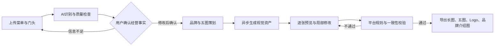
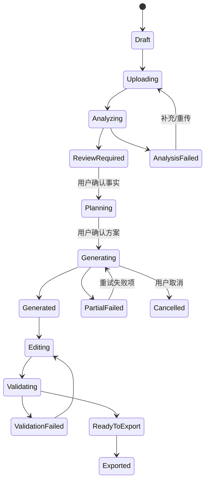
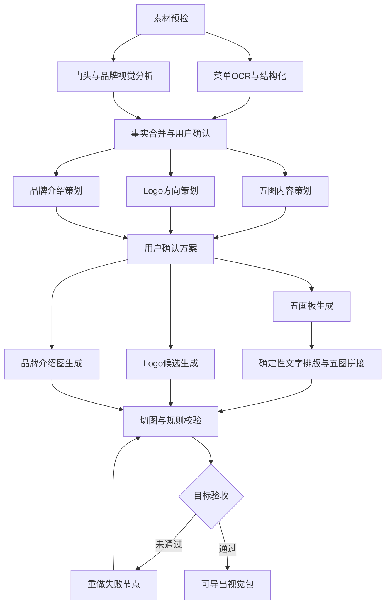
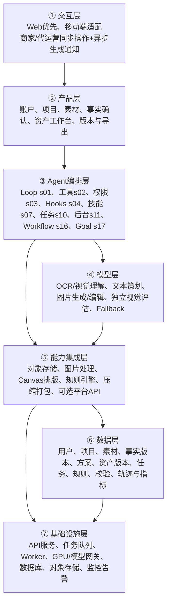

# 本地生活 AI 团购视觉生成产品 PRD

> 版本：V0.1 评审版  
> 日期：2026-08-28  
> 状态：待创作者评审，不是最终版  
> 项目名称：待确认，本文暂称“本地生活 AI 团购视觉生成产品”  
> 产品路线：0→1 产品设计 + AI/Agent 产品  

## 0. 文档说明

### 0.1 一句话定义

商家上传店铺菜单和门头图片，AI提取真实经营信息、策划品牌表达并生成一套可编辑、可校验、可直接用于抖音团购与美团团购的首页五图、Logo和品牌介绍图。

### 0.2 信息分层

- `【创作者原话】`：保留需求提出者原始表达。
- `【已确认】`：已在沟通中明确的产品事实或决策。
- `【AI建议】`：为了形成可评审方案提出，需创作者确认。
- `【待确认假设】`：会影响范围、成本或交互的未决事项。
- `【资料约束】`：来自“焚诀/agent-blueprint”的架构与交付要求。

### 0.3 版本记录

| 版本 | 日期 | 状态 | 主要内容 |
| --- | --- | --- | --- |
| V0.1 | 2026-08-28 | 评审版 | 首次形成完整产品范围、AI工作流、业务规则、架构选型、验收与评审问题 |

### 0.4 资料来源

1. 【创作者原话】“第一需求就是做团购首页5图。”
2. 【创作者原话】“五图上传规则是，一张长图，裁剪成五张横屏4:3图片。”
3. 【创作者原话】核心竞品为抖音来客和美团生意宝，两边后台均已有一键生图能力。
4. 【创作者原话】五图对应没有设计能力的商家，以及需要批量服务商家的代运营团队的痛点。
5. 【创作者原话】用户上传店铺菜单、门头图片，AI分析后输出五图、Logo、品牌介绍图，用于抖音团购、美团团购。
6. 【资料约束】[Agent Blueprint README](/Users/pareto.chouchou/Desktop/焚诀/agent-blueprint/README.md)、[架构蓝图](/Users/pareto.chouchou/Desktop/焚诀/agent-blueprint/BLUEPRINT.md)、[长期需求](/Users/pareto.chouchou/Desktop/焚诀/agent-blueprint/docs/requirements.md)及17个组件说明。

---

## 1. 需求理解摘要（确认点1）

### 1.1 项目背景与现状

【已确认】抖音来客、美团生意宝已在各自后台提供一键生图能力，因此“能生成图片”已是平台基础能力，不足以构成独立竞争优势。

【已确认】大量本地生活商家缺少设计人员、设计软件使用能力和平台视觉规范知识；代运营团队则需要同时服务多个门店，面临重复制作、素材沟通、反复修改和跨平台适配成本。

【已确认】团购首页五图是第一核心需求。产品需要把商家已有的菜单、门头等低结构化素材，转化成可直接用于抖音团购与美团团购的结构化视觉资产。

### 1.2 目标用户

| 用户 | 典型特征 | 当前问题 | 期望结果 |
| --- | --- | --- | --- |
| 单店商家/店长 | 无专职设计，主要使用手机 | 不会策划五图、不懂尺寸与安全区、素材质量参差 | 少填信息，快速得到可上传成品 |
| 连锁品牌运营 | 多门店、需要统一品牌 | 门店素材分散，品牌风格难统一 | 统一模板并按门店批量生成 |
| 本地生活代运营 | 同时服务多个商家 | 重复设计、频繁改价、交付和复用效率低 | 项目化管理、快速改版、批量交付 |

### 1.3 核心问题

1. 菜单和门头图片包含的信息不结构化，商家仍需手工整理套餐、价格和门店信息。
2. 商家不知道五张图分别应该表达什么，容易产出五张重复海报。
3. 通用作图软件需要选模板、换图、排版、切图，仍有学习成本。
4. AI直接生图容易编造菜品、价格、品牌信息或生成不可编辑的乱码文字。
5. 抖音、美团的展示与审核规范可能变化，需要规则版本化，不能写死在模型Prompt中。
6. 一张长图切成五张时容易出现文字跨切线、边界错位、顺序错误或图片比例不合规。

### 1.4 期望结果与可见价值

【已确认】用户完成一次素材上传后，至少获得：

- 团购首页五图：5张横屏4:3图片；
- 五图设计母版：一张可预览的连续长图；
- Logo：原创Logo候选及选定版；
- 品牌介绍图：用于团购详情或门店品牌展示；
- 结构化分析结果：AI从菜单和门头中识别出的门店、品类、商品与价格信息。

【AI建议】产品价值不表述为“AI一键生图”，而表述为：

> 从店铺原始素材到双平台可用视觉资产，一次分析、整套生成、逐张可改、规则可验。

### 1.5 已知、未知与冲突

| 类型 | 内容 | 处理方式 |
| --- | --- | --- |
| 已确认 | 五图为P0第一需求 | 纳入MVP主闭环 |
| 已确认 | 输入至少包含菜单图、门头图 | 作为创建任务的核心输入 |
| 已确认 | 输出包含五图、Logo、品牌介绍图 | 同一项目下统一管理 |
| 已确认 | 五图为五张横屏4:3图片 | 作为硬验收项 |
| 已确认 | 目标平台为抖音团购、美团团购 | 提供平台选择与分别校验 |
| 待确认 | “长图”是横向五画板还是竖向堆叠工作母版 | V0.1按横向连续五画板设计，同时保留可配置能力 |
| 待确认 | 两个平台当前准确像素、文件大小、格式、文字安全区和审核规则 | 上线前由运营提供官方最新版规则并版本化 |
| 待确认 | 一期是否直连平台并自动上传 | V0.1默认只导出，不自动发布 |
| 待确认 | 商家已有Logo时是沿用、优化还是重新生成 | 默认先检测并让用户选择 |
| 待确认 | 素材保存期限、删除机制和是否用于模型训练 | 上线前必须完成隐私决策 |

---

## 2. 产品目标与非目标

### 2.1 产品目标

1. 把菜单图、门头图中的有效信息转成可确认的结构化经营资料。
2. 自动完成团购首页五图的内容策划、视觉生成、切图和平台规则校验。
3. 在同一项目中生成并统一管理Logo与品牌介绍图。
4. 支持非设计用户通过换图、改字、局部重做完成修改。
5. 让代运营能够保存项目、复用模板并快速交付多个商家。

### 2.2 北极星指标

【AI建议】“有效视觉包完成率”：创建生成任务的用户中，最终成功导出一套通过产品规则校验的五图、Logo和品牌介绍图的比例。

### 2.3 非目标

MVP暂不包含：

- 自动登录或控制抖音来客、美团生意宝后台；
- 自动提交审核、自动发布或自动修改线上商品；
- 完整PS/Figma级自由设计能力；
- 视频、直播间、达人探店内容生成；
- 基于真实投放数据的自动A/B优化；
- 无人工确认的全自动品牌命名、价格决策或套餐上架；
- 多Agent团队编排、定时自治运营等与首版闭环无直接关系的能力。

---

## 3. 市场与竞品判断

### 3.1 直接竞品

| 竞品 | 已知能力 | 对我们的含义 |
| --- | --- | --- |
| 抖音来客 | 商家后台一键生图、对话式经营助手/上品入口 | 单纯生图是基线，需要跨平台、可编辑与事实校验 |
| 美团生意宝 | 商家后台一键生图 | 需要同时覆盖美团与抖音，不与单平台后台做同质工具 |

### 3.2 作图工具样本

| 工具 | 可借鉴 | 不应照搬 |
| --- | --- | --- |
| 稿定设计 | 大众五连图和团购模板、拖拽编辑、模板体系 | 让商家自己找模板并完成大量设计操作 |
| 创客贴 | AI商品图、智能改图、批量设计、品牌管制和团队协作 | 过宽的通用设计工作台和复杂工具栏 |

### 3.3 差异化定位

【AI建议】差异化不在“生成一张图”，而在以下闭环：

1. 菜单与门头图片自动理解；
2. 经营事实先确认，避免AI编造；
3. 五图承担连续的信息叙事；
4. 同一素材适配抖音和美团；
5. 长图母版与五张独立4:3图片同步生成；
6. 支持局部可控修改；
7. 输出前完成规则与内容一致性校验。

---

## 4. MVP范围与优先级（确认点2）

### 4.1 核心价值闭环



### 4.2 功能清单

| 优先级 | 模块 | 功能 | MVP |
| --- | --- | --- | --- |
| P0 | 项目创建 | 创建店铺项目、选择目标平台和行业 | 是 |
| P0 | 素材上传 | 上传菜单、门头和可选环境/商品图 | 是 |
| P0 | AI分析 | OCR、视觉识别、素材质量检查、字段置信度 | 是 |
| P0 | 事实确认 | 用户确认店名、品类、商品、价格及规则 | 是 |
| P0 | 五图策划 | 自动生成五张图的信息结构与文案 | 是 |
| P0 | 五图生成 | 生成连续母版和五张4:3图片 | 是 |
| P0 | 可控修改 | 改字、换图、单张重做、整套换风格 | 是 |
| P0 | 规则校验 | 比例、尺寸、越界、乱码、价格一致性、素材真实性 | 是 |
| P0 | 导出 | 五图编号下载、长图母版、Logo、品牌介绍图、ZIP | 是 |
| P1 | Logo生成 | 多候选、文字Logo与图形Logo、沿用已有Logo | 是，简化版 |
| P1 | 品牌介绍图 | 基于已确认事实生成品牌故事与门店介绍 | 是，单规格 |
| P1 | 项目历史 | 保存版本、复制项目、再次编辑 | 是，基础版 |
| P1 | 模板与品牌资产 | 行业模板、品牌色、字体与Logo锁定 | 后续增强 |
| P2 | 批量门店 | 多门店批量生成与差异化替换 | 否 |
| P2 | 平台直发 | 调用平台开放接口提交草稿或审核 | 否 |
| P2 | 数据优化 | 读取曝光/点击/成交数据并自动迭代五图 | 否 |

### 4.3 建议PRD目录

本版本已包含：背景、用户、目标、范围、流程、功能、规则、状态、Agent架构、模型与知识、权限安全、异常、数据、指标、评测、验收、灰度及评审问题。后续创作者可决定是否拆分为“产品PRD”和“AI技术规范”两份文档。

---

## 5. 用户旅程与页面结构

### 5.1 主旅程

| 阶段 | 用户目标 | 用户动作 | 系统反馈 | 决策点 |
| --- | --- | --- | --- | --- |
| 创建项目 | 开始为门店做图 | 输入店名，选择抖音/美团、行业 | 创建草稿并显示所需素材 | 是否双平台生成 |
| 上传素材 | 提供真实经营资料 | 上传菜单图、门头图，可补环境/商品图 | 展示上传进度与质量提示 | 素材是否足够 |
| AI分析 | 少填信息 | 等待或离开页面 | 展示识别进度、字段、置信度和问题 | 是否修改识别结果 |
| 事实确认 | 确保内容真实 | 核对店名、商品、价格、地址和卖点 | 标记已确认字段 | 是否允许开始生成 |
| 方案确认 | 确认五图表达 | 查看五图大纲、Logo方向、品牌关键词 | 可修改文案和风格方向 | 是否生成整套视觉 |
| 生成 | 得到第一版 | 等待，可取消或离开 | 分阶段进度、单项结果陆续出现 | 失败项是否重试 |
| 编辑 | 调整成可用版本 | 换图、改字、单张重做、选择Logo | 只重算受影响资产 | 是否达到可导出状态 |
| 校验导出 | 上平台使用 | 选择平台并点击检查/导出 | 显示错误、警告和通过状态 | 修复或带警告导出 |

### 5.2 建议页面

1. 项目列表页；
2. 创建项目/平台选择页；
3. 素材上传页；
4. AI分析进度页；
5. 经营事实确认页；
6. 五图策划确认页；
7. 视觉资产工作台；
8. 规则检查与平台预览页；
9. 导出与历史版本页。

---

## 6. 详细功能需求

### 6.1 项目创建

#### 输入

- 项目/店铺名称；
- 目标平台：抖音团购、美团团购，可多选；
- 经营行业：餐饮、美业、休闲娱乐、亲子、健身、生活服务等；
- 角色：商家、连锁运营、代运营；
- 是否已有Logo。

#### 规则

1. 项目创建后获得唯一项目ID。
2. 平台规则版本与项目绑定，导出时重新检查是否存在新版本。
3. 用户可以保存草稿；未上传素材时显示明确空状态。

### 6.2 素材上传与管理

#### 必传素材

- 至少1张菜单/价目表图片；
- 至少1张门头图片。

#### 可选素材

- 菜品、服务项目、环境、员工、证书、现有Logo；
- 店铺名称、地址、联系电话和套餐文本的手动补充。

#### 处理规则

1. 上传后立即进行格式、分辨率、清晰度、重复图和明显水印检查。
2. 低清、严重反光、遮挡、文字过小或无法识别时，标出具体图片和原因。
3. 原始素材保留，不因裁剪、增强或生成覆盖。
4. AI生成内容与真实素材必须可区分并保留来源关系。
5. 不得读取或展示图片中与任务无关的个人隐私信息。

【待确认假设】单文件格式暂按JPG/JPEG/PNG/WEBP设计；大小和数量上限由研发成本及平台规则评审后确定。

### 6.3 AI经营信息分析

#### 分析对象

- 门头：店铺名称、Logo、品牌色、行业、门店环境和可用视觉元素；
- 菜单：商品/服务名称、分类、价格、规格、套餐组合和高频卖点；
- 补充素材：场景、人群、服务过程、环境质感和信任元素。

#### 输出字段

| 字段 | 来源 | 是否必须确认 |
| --- | --- | --- |
| 店铺名称 | 门头识别/用户输入 | 是 |
| 经营品类 | 视觉分类/用户选择 | 是 |
| 商品或服务项目 | 菜单OCR | 是 |
| 商品价格 | 菜单OCR | 是 |
| 套餐内容 | 菜单OCR+AI归纳 | 是 |
| 门店地址 | 图片/用户补充 | 若使用则必须确认 |
| 品牌色 | 图片分析 | 否，可修改 |
| 品牌关键词 | AI建议 | 否，可修改 |
| 核心卖点 | AI建议，需有素材或事实依据 | 是 |

#### 真实性规则

1. 每个事实字段保存来源图片、识别区域、原始文本、标准化值和置信度。
2. 价格、套餐、地址、营业时间、证书、销量、排名和功效不得在无证据时生成。
3. 低置信度字段必须高亮并阻止直接进入生成。
4. 用户修改后的值高于AI识别值，并记录修改日志。
5. “未识别”必须明确展示，不能用模型猜测填空。

### 6.4 五图内容策划

系统在生成图片前先输出可编辑的五图大纲：

| 图片 | 信息职责 | 默认内容 | 禁止 |
| --- | --- | --- | --- |
| 第1图 | 吸引点击 | 店名/套餐名、核心卖点、主视觉 | 堆叠大量购买须知 |
| 第2图 | 解释供给 | 菜品、服务或套餐内容 | 编造未提供项目 |
| 第3图 | 展示利益 | 团购价、原价、优惠和适用人数 | 未确认价格、虚假折扣 |
| 第4图 | 建立信任 | 门店环境、服务过程、品牌特点 | 无证据的排名、销量、认证 |
| 第5图 | 降低风险 | 使用时间、预约、适用门店、重点须知 | 隐藏关键限制条件 |

#### 策划规则

1. 五张图是连续信息叙事，不是五张内容重复的海报。
2. 每张图必须有独立标题和单一主任务。
3. 重要信息不得跨越裁切线。
4. 价格、店名、Logo和套餐信息在五图中保持一致。
5. 用户确认大纲后才能启动高成本图像生成。

### 6.5 五图母版、裁切与导出

#### 硬规则

【已确认】最终输出5张横屏4:3图片。

【待确认假设】V0.1以横向无缝长图为母版：

- 单图尺寸：`W × H`，且`W:H = 4:3`；
- 横向母版尺寸：`5W × H`，整体比例为`20:3`；
- 示例：单图1440×1080时，母版为7200×1080；
- 裁切边界：`[0,W)`、`[W,2W)`、`[2W,3W)`、`[3W,4W)`、`[4W,5W)`。

#### 产品实现要求

1. 内部数据使用五个独立4:3画板，不依赖对超长位图进行二次识别。
2. 长图仅作为连续预览和母版导出；五张独立画板是平台交付真源。
3. 五画板共享品牌令牌、文字样式和连续背景坐标。
4. 支持显示裁切线、图片序号、文字安全区和平台预览。
5. 导出文件命名为`项目名_平台_01`至`05`，顺序不可变化。
6. 同时导出长图母版、五张图片和ZIP包。
7. 不能出现漏切、重切、边缘黑线、缩放变形或相邻画面错位。

### 6.6 Logo生成

#### 流程

1. 检测门头或上传素材中是否已有Logo；
2. 用户选择“沿用”“优化”“重新生成”；
3. AI根据已确认的店名、行业、品牌关键词和色彩生成候选；
4. 用户选定一版，可修改文字、颜色和图形方向；
5. 输出透明背景版、浅色背景版和深色背景版。

#### 规则

1. Logo中的店名必须使用已确认文本，不允许乱码。
2. 不得模仿或混淆知名品牌商标。
3. 若无法保证中文文字准确，图形与文字应分层生成，由确定性排版引擎写入文字。
4. 用户必须确认其对上传品牌素材具有使用权。

### 6.7 品牌介绍图

默认包含：店铺名称、经营品类、品牌一句话、门店特点、环境/商品图片和Logo。

1. 品牌文案只允许使用已确认事实和明确标记的营销表达。
2. 不得自动生成“第一”“最好”“销量领先”等无法证明的内容。
3. 支持修改文案、换图、换版式和重新生成背景。
4. MVP提供一个主规格；平台差异化规格进入后续版本或由规则中心配置。

### 6.8 编辑与重生成

用户可执行：

- 修改确定性文字；
- 替换某张真实图片；
- 调整图片裁切位置；
- 切换整套配色/字体/模板；
- 只重做第N张；
- 只修改背景、主体或布局；
- 选择Logo候选；
- 回到任一历史版本。

#### 依赖失效规则

| 上游变更 | 必须失效/重算的下游资产 |
| --- | --- |
| 店铺名称 | Logo文字、五图店名、品牌介绍图、导出文件名 |
| 商品/价格 | 涉及该商品或价格的五图、品牌介绍文案、校验结果 |
| Logo | 五图和品牌介绍图中的Logo引用 |
| 品牌色/模板 | 五图、Logo展示版、品牌介绍图 |
| 平台规则版本 | 仅重新校验；必要时生成新尺寸，不改事实内容 |

系统不得在上游变更后继续把旧资产标为“可导出”。

### 6.9 规则校验

校验分为确定性校验和AI视觉审核：

#### 确定性校验

- 数量是否为5；
- 比例是否为4:3；
- 像素、格式、文件大小是否符合所选平台规则版本；
- 文件是否可打开；
- 裁切区域是否完整且无重叠；
- 文字框是否越过切线或安全区；
- 店名、价格和套餐字段是否与已确认值一致；
- 输出顺序和文件名是否正确。

#### AI视觉审核

- 是否存在明显乱码、畸形Logo或不可辨识主体；
- 五张图是否内容高度重复；
- 图片与经营品类是否明显不符；
- 是否出现无来源的商品、环境、人物或资质暗示；
- 视觉层级是否足以支持阅读。

AI视觉审核只能给出风险结论，硬规则由确定性程序判断。

### 6.10 导出

导出包建议结构：

```text
项目名_YYYYMMDD/
├── 抖音团购/
│   ├── 项目名_抖音_01.png
│   ├── ...
│   └── 项目名_抖音_05.png
├── 美团团购/
│   ├── 项目名_美团_01.png
│   ├── ...
│   └── 项目名_美团_05.png
├── 品牌资产/
│   ├── logo-transparent.png
│   ├── logo-light.png
│   ├── logo-dark.png
│   └── 品牌介绍图.png
├── 母版/
│   └── 五图连续长图.png
└── 生成说明.json
```

`生成说明.json`记录项目ID、版本、平台规则版本、确认字段摘要、生成时间和校验结果，不包含模型隐性推理。

---

## 7. 状态与异常流程

### 7.1 项目状态机



### 7.2 异常处理

| 异常 | 系统处理 | 用户可做什么 |
| --- | --- | --- |
| 菜单无法识别 | 标出问题图片，不填充猜测值 | 重拍、上传PDF/清晰图、手动录入 |
| 门头无完整店名 | 显示低置信度 | 手动输入店名 |
| 图片清晰度不足 | 提供具体原因和拍摄建议 | 重传或继续使用但标记风险 |
| 图像生成超时 | 自动重试，保存已有结果 | 稍后继续、取消任务 |
| 单张生成失败 | 其他资产正常保留 | 只重试失败图片 |
| 中文文字错误 | 阻止通过校验 | 使用确定性文字层重排 |
| 价格不一致 | P0阻断导出 | 回到事实确认或修改图片 |
| Logo疑似侵权 | 标记高风险并阻止选定 | 更换方向或上传自有Logo |
| 平台规则更新 | 旧项目显示“需重新校验” | 一键按新规则校验/适配 |
| 用户取消生成 | 停止后续任务，不删除已有资产 | 恢复、重新生成或删除项目 |

### 7.3 重试原则

1. 所有异步任务必须幂等，重复请求不能产生不可控重复资产。
2. 单工具建议最多自动重试3次，指数退避；超过后进入可恢复失败状态。
3. 用户重试只执行失败节点和受其影响的下游节点。
4. 已确认事实和用户手工编辑不得因重试而丢失。

---

## 8. AI/Agent方案

### 8.1 Harness五要素

| 要素 | 本产品内容 |
| --- | --- |
| 工具 Tools | 上传解析、OCR、视觉分析、文案策划、图像生成、确定性排版、拼图裁切、规则校验、打包导出、项目存储 |
| 知识 Knowledge | 抖音/美团规则库、行业五图结构、营销文案规范、品牌设计规范、内容与广告合规规则 |
| 观察 Observation | OCR置信度、素材质量、任务状态、生成资产、校验结果、用户修改、导出结果、线上指标 |
| 行动 Action | 调用模型/API、生成与修改资产、更新任务状态、保存版本、导出文件；MVP不直接发布平台 |
| 权限 Permissions | 读取用户授权素材；生成前确认经营事实；写项目/导出自动；删除、对外发布、跨项目素材复用需明确授权 |

### 8.2 组件选型

根据“只选需要的组件”原则：

| 组件 | 选择 | 理由 |
| --- | --- | --- |
| s01 Agent Loop | 必选 | 支撑分析、工具调用和结果反馈 |
| s02 工具系统 | 必选 | OCR、生成、裁切、校验、导出均为独立工具 |
| s03 权限系统 | 必选 | 用户素材、Logo权利、删除与未来发布均有权限边界 |
| s04 Hooks | 必选 | 在生成前后统一执行事实检查、日志、合规审核 |
| s05 TodoWrite | 不单独采用 | 产品需要跨会话任务状态，使用s10替代 |
| s06 子Agent | MVP不采用 | 主流程固定，先避免不必要的上下文和成本 |
| s07 技能加载 | 必选 | 按平台、行业加载规则和五图范式，不把全部规则塞进上下文 |
| s08 上下文压缩 | P1 | 单次任务可控；长时间编辑会话再加入 |
| s09 记忆 | P1 | 记住品牌偏好、历史模板和门店资产 |
| s10 任务系统 | 必选 | 分析、策划、生成、校验是可恢复的依赖图 |
| s11 后台任务 | 必选 | 图像生成和批量导出耗时，不能阻塞交互 |
| s12 定时调度 | 不采用 | MVP没有定时自治需求 |
| s13 Agent Teams | 不采用 | 无需多工作区、多队友协作运行时 |
| s14 MCP插件 | 待外部接口确定 | 若平台或设计服务以MCP接入再采用 |
| s15 集成Harness | 必选 | 统一工具、Hooks、任务、权限和状态 |
| s16 Workflow Runtime | 必选 | 主流程固定，适合脚本化编排、事件进度和断点续跑 |
| s17 Goal Loop | 必选 | 只有交付物通过全部验收才算完成，不能凭Agent自述完成 |

### 8.3 固定工作流



### 8.4 Agent工具清单

以下为功能名，不代表最终官方API名：

| 工具 | 输入 | 输出 | 副作用 | 权限 |
| --- | --- | --- | --- | --- |
| `inspect_assets` | 项目ID、素材列表 | 格式/清晰度/重复/风险 | 写分析记录 | 自动 |
| `extract_menu` | 菜单素材 | 商品、分类、价格、坐标、置信度 | 写候选字段 | 自动 |
| `analyze_storefront` | 门头/环境素材 | 店名、现有Logo、品牌色、行业特征 | 写候选字段 | 自动 |
| `confirm_business_facts` | 用户确认字段 | 已锁定事实版本 | 更新事实真源 | 用户显式确认 |
| `plan_visual_package` | 事实版本、平台、行业 | 五图大纲、Logo方向、品牌介绍文案 | 写方案版本 | 自动，生成前需确认 |
| `generate_visual_asset` | 资产类型、提示词、参考图 | 图片资产、生成元数据 | 调用外部模型并写资产 | 已授权项目内自动 |
| `apply_text_layout` | 图片、确认文案、样式 | 文字准确的最终画板 | 写新版本 | 自动 |
| `compose_five_panel_master` | 五画板 | 连续长图母版 | 写母版 | 自动 |
| `slice_five_images` | 五画板/母版、规则版本 | 5张4:3图片 | 写导出候选 | 自动 |
| `validate_visual_package` | 资产、事实版本、平台规则 | 错误、警告、通过项 | 写校验报告 | 自动 |
| `package_export` | 已通过资产 | ZIP和清单 | 生成下载文件 | 用户触发 |
| `delete_project` | 项目ID | 删除结果 | 删除用户数据 | 二次确认 |

### 8.5 系统提示词责任边界草案

```text
你是本地生活团购视觉策划Agent。你的目标是基于用户授权的真实店铺素材，
生成可用于抖音团购和美团团购的五图、Logo与品牌介绍图。

必须遵守：
1. 经营事实以用户确认版本为唯一真源；不得猜测价格、商品、地址、资质、排名和销量。
2. 先分析和策划，用户确认事实与方案后再触发高成本生成。
3. 五图必须承担五个不同的信息任务，并最终输出5张4:3图片。
4. 文字使用确定性排版工具写入；发现乱码或不一致时不得标记完成。
5. 每次上游字段变化，失效对应的下游资产和旧校验结果。
6. 删除、对外发布、跨项目使用素材必须获得用户授权。
7. 工具失败应保存已完成节点，按任务状态重试，不重复执行成功副作用。
8. 只有确定性规则校验和视觉审核均通过，才可返回“可导出”。
```

### 8.6 模型分工

【AI建议】避免一个模型包办全部工作：

| 能力 | 建议模型/服务 | 选型重点 |
| --- | --- | --- |
| OCR与版面识别 | OCR + 多模态视觉模型 | 中文菜单、价格、坐标和置信度 |
| 经营信息归纳 | 文本/多模态模型 | 结构化JSON输出、禁止猜测 |
| 五图与品牌策划 | 文本模型 | 行业知识、营销表达、可追溯事实 |
| 图片生成/编辑 | 图像生成模型 | 参考图一致性、局部编辑、商业质感 |
| 中文文字落图 | 确定性Canvas/排版服务 | 文字准确、字体版权、安全区 |
| 视觉质量审核 | 独立视觉评估模型+规则 | 乱码、重复、事实偏差和布局风险 |

最终模型供应商、版本、成本上限和中国大陆可用性待技术选型，不在PRD中假定。

### 8.7 知识与规则库

1. 平台规则：平台、版本、生效时间、图片数量、比例、分辨率、大小、格式、安全区、禁止内容；
2. 行业五图范式：餐饮、美业、休闲娱乐、亲子等；
3. 品牌语言规范：字体、色彩、Logo使用、文案语气；
4. 合规规则：广告法风险词、价格表达、资质和功效宣称；
5. 生成模板：五图信息结构、品牌介绍结构和Logo方向。

平台规则必须由运营维护并可回滚；模型只读取命中版本，不负责凭记忆判断最新规则。

---

## 9. 七层产品架构



贯穿数据流：上传素材 → 创建项目与异步任务 → AI识别 → 用户确认事实 → 固定工作流生成多类资产 → 确定性排版/裁切 → 规则和视觉双校验 → 目标判断 → 导出；每个节点写入任务状态、资产版本、日志和轨迹。

横切关注点：

- 安全：身份鉴权、项目隔离、素材授权、敏感操作审批、内容合规和审计；
- 可观测：节点耗时、模型与工具错误、成本、重试、校验、用户修改和导出结果。

---

## 10. 数据模型

| 实体 | 核心字段 |
| --- | --- |
| User | user_id、role、tenant_id、权限 |
| StoreProject | project_id、name、industry、platforms、status、rule_versions |
| SourceAsset | asset_id、type、url、hash、quality、authorization、metadata |
| BusinessFact | fact_id、field、value、source_asset、bbox、confidence、confirmed_by、version |
| VisualPlan | plan_id、fact_version、five_panel_outline、brand_keywords、status |
| GeneratedAsset | asset_id、type、panel_index、version、source_refs、generation_meta、status |
| PlatformRule | platform、rule_version、effective_at、constraints、status |
| ValidationReport | report_id、asset_version、rule_version、errors、warnings、passed |
| WorkflowRun | run_id、project_id、status、current_phase、journal、retry_count |
| ExportPackage | export_id、project_id、asset_versions、manifest、created_at |

关键约束：

1. 每个生成资产必须能追溯到事实版本、方案版本和输入素材。
2. 每份校验报告必须绑定资产版本和平台规则版本。
3. 资产不可静默覆盖，修改生成新版本。
4. 项目、素材、任务和导出包必须按租户隔离。

---

## 11. 权限、隐私与合规

### 11.1 权限矩阵

| 动作 | 商家 | 代运营成员 | 管理员 |
| --- | --- | --- | --- |
| 上传项目素材 | 自有项目 | 被授权项目 | 可配置 |
| 查看/修改事实 | 自有项目 | 被授权项目 | 可审计 |
| 生成和重做资产 | 自有项目 | 被授权项目 | 可配置额度 |
| 导出资产 | 自有项目 | 被授权项目 | 可配置 |
| 删除项目 | 二次确认 | 需项目权限+二次确认 | 审计操作 |
| 跨项目复用素材 | 明确选择 | 需授权 | 可配置 |
| 对外发布 | MVP不提供 | MVP不提供 | MVP不提供 |

### 11.2 隐私规则

1. 上传页面明确说明素材用途、保存期限和删除方式。
2. 默认不得将用户素材用于公共模板或训练集。
3. 日志不得写入原图、完整菜单正文或个人联系方式。
4. 生成服务调用第三方模型时必须披露数据路径和保留政策。
5. 用户删除项目后，业务数据库和对象存储按约定期限删除，并保留最小审计记录。

### 11.3 内容合规

1. 对虚假价格、功效承诺、绝对化用语、未授权商标进行检测。
2. AI建议不等于法律或平台审核结论；高风险内容需用户修改。
3. 平台规则有冲突时分别生成平台版本，不用一个“通用版”强行通过两端。

---

## 12. 非功能需求

| 类别 | 要求 |
| --- | --- |
| 可运行 | 配置和密钥外置；开发、测试、生产环境隔离 |
| 可容错 | 节点超时、重试、取消、部分失败和断点续跑 |
| 可观测 | 结构化日志、指标、任务轨迹、模型成本和生成版本 |
| 可测试 | 工具、工作流、权限、规则、裁切、状态机和AI评测均有测试 |
| 可部署 | Web/API服务、任务队列、Worker、对象存储和监控有明确部署说明 |
| 可度量 | 指标对应用户目标，不能以“模型返回成功”替代产物验证 |
| 性能 | 分析和生成异步；用户可离开页面并继续查看进度 |
| 可靠性 | 状态写入原子化；任务重复执行幂等；成功资产不因失败重试丢失 |
| 兼容性 | 主流桌面与移动浏览器；中文文件名和多图上传可用 |

【资料核对】“焚诀”文件夹内携带的`.venv`绑定了其他电脑的绝对路径，当前不可运行；这验证了环境不可随包分发，正式项目必须通过依赖清单和初始化脚本重建环境。

---

## 13. 埋点与指标

### 13.1 漏斗指标

| 阶段 | 指标 |
| --- | --- |
| 创建 | 项目创建数、平台选择分布、用户角色分布 |
| 上传 | 上传完成率、平均素材数、素材不合格率 |
| 分析 | 分析成功率、字段识别率、低置信字段率、用户修改率 |
| 确认 | 事实确认率、方案确认率、确认耗时 |
| 生成 | 整套生成成功率、单项失败率、平均耗时、平均成本 |
| 编辑 | 单张重做率、文字修改率、换图率、Logo选定率 |
| 校验 | 首次通过率、各错误类型占比、修复后通过率 |
| 导出 | 有效视觉包完成率、导出率、双平台导出率、再次打开率 |

### 13.2 建议目标值

以下为【AI建议】，需产品、算法和业务评审后确认：

| 指标 | MVP建议门槛 |
| --- | --- |
| 五图数量与4:3比例正确率 | 100% |
| 裁切无漏切/重切/黑边 | 100% |
| 已确认店名和价格一致率 | ≥99.9% |
| 菜单分析任务成功率 | ≥95% |
| 整套视觉任务技术成功率 | ≥95% |
| 规则校验服务可用性 | ≥99.5% |
| 创建到首版视觉包P90耗时 | ≤5分钟 |
| 首版无需整套重做的比例 | ≥60% |

### 13.3 核心埋点

| 事件 | 关键属性 |
| --- | --- |
| project_created | role、industry、platforms |
| asset_uploaded | type、format、size、quality_result |
| analysis_completed | duration、field_count、low_confidence_count |
| fact_corrected | field、source、before_confidence |
| plan_confirmed | platform、template、edit_count |
| generation_started/completed | asset_type、model、duration、cost、status |
| asset_regenerated | panel_index、reason、edit_mode |
| validation_completed | platform、rule_version、errors、warnings |
| export_completed | formats、platforms、asset_versions |

---

## 14. AI评测与测试方案

### 14.1 离线评测集

【AI建议】建立不少于300个脱敏项目样本，覆盖：

- 核心样本60%：清晰菜单、标准门头、餐饮/美业/休闲娱乐等主行业；
- 边缘样本25%：手写菜单、反光、倾斜、多语言、小字、无Logo、多门店、多价格；
- 对抗与高风险样本15%：虚假折扣、敏感词、他人商标、无来源资质、恶意提示文字。

### 14.2 评测维度

| 能力 | 评测方法 | 上线门槛方向 |
| --- | --- | --- |
| OCR | 字段级精确率/召回率，价格单独统计 | 价格错误必须低于普通文字错误 |
| 事实归纳 | 与人工标注JSON比对 | 不允许新增无来源事实 |
| 五图策划 | 人工评分：完整性、差异性、行业匹配 | 五图职责不可重复 |
| 图片质量 | 视觉评审：主体、风格、真实感、文字 | 乱码/畸形Logo为阻断 |
| 事实一致 | 自动对比确认字段与图片文字 | 店名和价格错误为阻断 |
| 裁切 | 像素级边界测试 | 100%正确 |
| 合规 | 已知规则Case+人工复核 | P0规则不得漏检 |

### 14.3 工程测试

1. 工具Schema与非法参数测试；
2. 权限和跨租户访问测试；
3. 任务状态迁移、重复回调和幂等测试；
4. 超时、失败、重试、取消和断点续跑测试；
5. 五图拼接、切图、分辨率和文件命名测试；
6. 上游字段变化导致下游失效的依赖测试；
7. 平台规则版本升级与旧项目重校验测试；
8. 日志脱敏、项目删除和数据保留测试。

---

## 15. 验收标准

### 15.1 产品主流程验收

1. 用户可创建店铺项目并选择抖音、美团或双平台。
2. 用户可上传至少一张菜单图和一张门头图。
3. 系统展示AI识别字段、置信度和来源，允许用户修改确认。
4. 未确认低置信度价格或店名时，不允许进入最终生成。
5. 用户可先确认五图大纲，再生成图片。
6. 系统最终生成五张横屏4:3图片、一张连续长图、Logo和品牌介绍图。
7. 用户可修改文字、换图、单张重做和整套换风格。
8. 系统能检测数量、比例、裁切、文字越界、乱码和事实不一致。
9. 校验通过后可一次下载完整ZIP；失败时明确指出第几张图、什么问题、如何修复。
10. 任务中断后再次进入项目，已确认事实、已生成资产和任务进度可恢复。

### 15.2 五图专项验收

1. 图片数量严格为5；
2. 每张比例严格为4:3；
3. 顺序严格为01—05；
4. 五图母版与五个导出画板内容一致；
5. 相邻画面无间隙、重叠、黑线和缩放变形；
6. 重要文字和Logo不跨裁切线；
7. 五张图分别完成吸引、解释、利益、信任、须知的信息职责；
8. 店名、套餐和价格与用户确认事实一致；
9. 修改单张不重置其他四张；
10. 导出包包含母版、五图、Logo、品牌介绍图和生成说明。

---

## 16. 灰度、监控与回滚

### 16.1 灰度建议

1. 第一阶段：内部运营人员，限定餐饮行业和少量模板；
2. 第二阶段：邀请制商家/代运营，覆盖美业和休闲娱乐；
3. 第三阶段：开放更多行业、双平台差异化模板和项目复制；
4. 平台直发、批量门店和数据优化单独立项评审。

### 16.2 线上监控

- OCR失败率、价格修改率；
- 生成失败/超时/重试率；
- 乱码、事实不一致和Logo风险命中率；
- 校验首次通过率与导出成功率；
- 单项目模型成本与P50/P90耗时；
- 用户整套重做率、投诉和删除请求。

### 16.3 回滚

1. 模型、Prompt、模板和平台规则均需版本化；
2. 新版本指标异常时可切回上一稳定版本；
3. 旧资产保留其原生成和规则版本，不静默重写；
4. 平台规则出现误配置时停止“可上传”声明，并重新校验受影响项目。

---

## 17. 依赖与风险

| 类型 | 风险 | 严重度 | 建议 |
| --- | --- | --- | --- |
| 业务 | 抖音/美团规则未获得官方最新版 | P0 | 上线前确定规则负责人、版本和更新机制 |
| 产品 | Logo是否属于MVP核心价值未确认 | P1 | 五图优先，Logo异步并可跳过 |
| AI | 菜单价格OCR错误 | P0 | 字段来源+置信度+人工确认+自动一致性检查 |
| AI | 图片中文字乱码 | P0 | 图片与文字分层，确定性排版写字 |
| AI | 生成不存在的商品/环境 | P0 | 真实素材优先，生成资产标识，视觉审核阻断 |
| 法务 | 商标、字体、素材版权 | P0 | 授权声明、商用字体库、相似商标检测与审计 |
| 隐私 | 门头/菜单含电话、人脸等信息 | P0 | 最小化处理、脱敏日志、保存期限和删除机制 |
| 工程 | 图像生成耗时长或部分失败 | P1 | 后台任务、局部重试、断点续跑 |
| 成本 | 多轮重做导致模型成本不可控 | P1 | 生成前确认、额度、缓存和单节点重做 |
| 体验 | 通用模板导致行业不匹配 | P1 | 先聚焦餐饮，再扩行业技能与模板 |
| 运营 | 平台过审不等于图片质量高 | P1 | 分开“规则通过”与“营销质量评分” |

---

## 18. 模拟需求评审（确认点3）

| 编号 | 角色 | 问题或风险 | 严重度 | 建议方案 | 创作者结论 |
| --- | --- | --- | --- | --- | --- |
| R-01 | 产品 | 项目正式名称、MVP行业范围未确认 | P1 | 暂定餐饮为首发行业 | 待确认 |
| R-02 | 业务/运营 | 抖音和美团当前官方图片规格、审核要求缺失 | P0 | 上线前提供规则原文和维护负责人 | 待确认 |
| R-03 | 产品 | “一张长图”横向还是竖向母版未最终确认 | P0 | 默认横向20:3，导出五张4:3 | 待确认 |
| R-04 | 设计 | MVP是模板编辑还是自由画布未确认 | P1 | 采用结构化画板+有限编辑 | 待确认 |
| R-05 | 后端 | 图像生成供应商、并发和成本上限未确认 | P1 | 完成模型PoC和单项目成本测算 | 待确认 |
| R-06 | AI/算法 | OCR、图生图、Logo、视觉审核的候选模型未评测 | P0 | 建300例基准集，完成离线评测 | 待确认 |
| R-07 | 前端 | 是否Web优先、是否需要微信小程序未确认 | P1 | MVP Web响应式，后续小程序 | 待确认 |
| R-08 | 测试 | 缺少各行业真实脱敏菜单和门头样本 | P0 | 业务提供首批测试集和授权证明 | 待确认 |
| R-09 | 法务 | 上传素材、生成Logo与商用字体的权利边界未确认 | P0 | 上线前完成协议、字体和版权方案 | 待确认 |
| R-10 | 数据 | 素材保留期限、训练使用和删除SLA未确认 | P0 | 默认不训练，确定保留与删除策略 | 待确认 |
| R-11 | 商业 | 免费额度、付费点和代运营席位模式未确认 | P2 | MVP验证价值后单独设计商业化 | 待确认 |
| R-12 | 工程 | 原文件夹内现成`.venv`不可跨机器运行 | P1 | 不分发虚拟环境，提供锁定依赖与初始化脚本 | 已由资料约束确认 |

---

## 19. 待创作者确认的关键决策

为了进入V0.2方案细化，优先确认以下三项：

1. **项目正式名称与首发用户**：先做单店商家，还是先服务代运营团队？
2. **五图母版方向**：是否确认采用横向连续长图，整体20:3，自动切成5张4:3？
3. **MVP发布边界**：仅生成和下载，还是必须在第一期直接提交抖音来客/美团生意宝？

其次需要业务补充：

- 两个平台当前官方上传规则原文或后台截图；
- 首发行业和10—30组真实脱敏菜单/门头样本；
- Logo是必须与五图同时完成，还是允许稍后生成；
- 素材保存期限及是否允许用于产品评测/模型训练。

---

## 20. 下一版本计划

创作者完成上述关键确认后，V0.2将补充：

1. 明确的项目正式名称和MVP范围；
2. 抖音/美团平台规则表及规则版本；
3. 页面级原型与交互说明；
4. 每个工作流节点的输入输出JSON Schema；
5. 模型PoC、成本与时延选型；
6. 测试数据集、效果基线和上线门槛；
7. 研发拆解与排期；
8. 评审结论和阻断项负责人。

只有创作者明确“确认定稿”后，文档才会进入最终版目录并标记V1.0。
